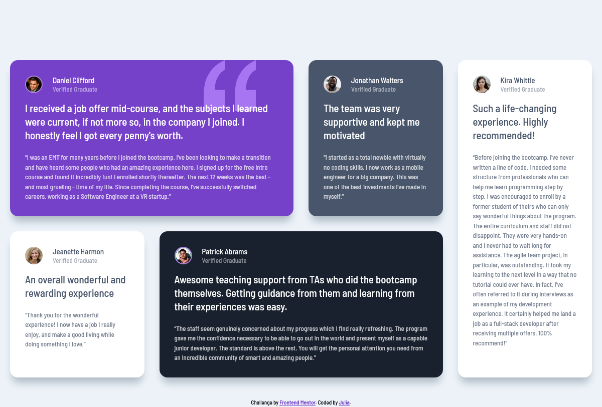

# Frontend Mentor - Testimonials grid section solution

This is a solution to the [Testimonials grid section challenge on Frontend Mentor](https://www.frontendmentor.io/challenges/testimonials-grid-section-Nnw6J7Un7). Frontend Mentor challenges help you improve your coding skills by building realistic projects. 

## Table of contents

- [Frontend Mentor - Testimonials grid section solution](#frontend-mentor---testimonials-grid-section-solution)
  - [Table of contents](#table-of-contents)
  - [Overview](#overview)
    - [The challenge](#the-challenge)
    - [Screenshot](#screenshot)
    - [Links](#links)
  - [My process](#my-process)
    - [Built with](#built-with)
    - [What I learned](#what-i-learned)
    - [Continued development](#continued-development)
    - [Useful resources](#useful-resources)
  - [Author](#author)

## Overview

### The challenge

Users should be able to:

- View the optimal layout for the site depending on their device's screen size

### Screenshot

### Links

- Solution URL: [Add solution URL here](https://github.com/yulich81/testimonials-grid-section-main)
- Live Site URL: [Add live site URL here](https://vocal-lolly-251525.netlify.app/)

## My process

### Built with

- Semantic HTML5 markup
- CSS custom properties
- Flexbox
- CSS Grid
- Mobile-first workflow
- BEM syntax

### What I learned

I've learned how to display cards within grid layout with grid-columns and grid-rows properties.

### Continued development

Continue practice css grid and flexbox to gain more experience and knowledge.

### Useful resources

- [Traversy media free tutorials](https://traversymedia.com/guide) - This helped me to properly structure html and build responsive web sites with grid layout and flexbox.

## Author

- Codepen.io - [Julia](https://codepen.io/yulich)
